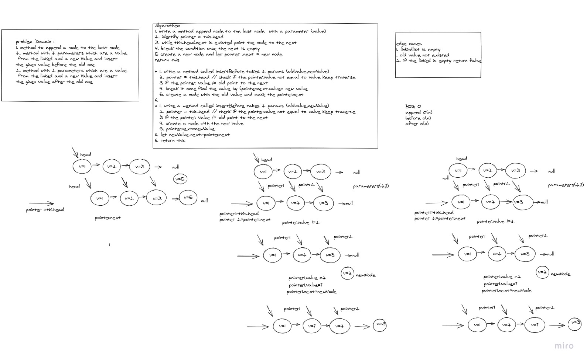
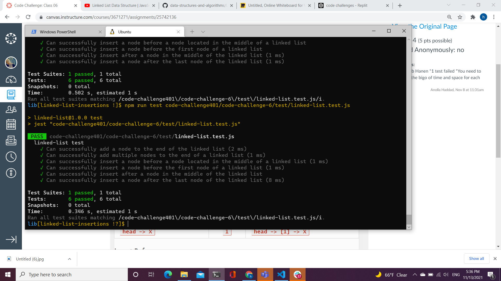

# Challenge Summary
 implement some methods to linkedList depending on certein situation like before a given or after a value

## Whiteboard Process

## Approach & Efficiency
* BIG O
- append O(n) time and space
- after o(n)
- before o(n)
## Solution
- 

