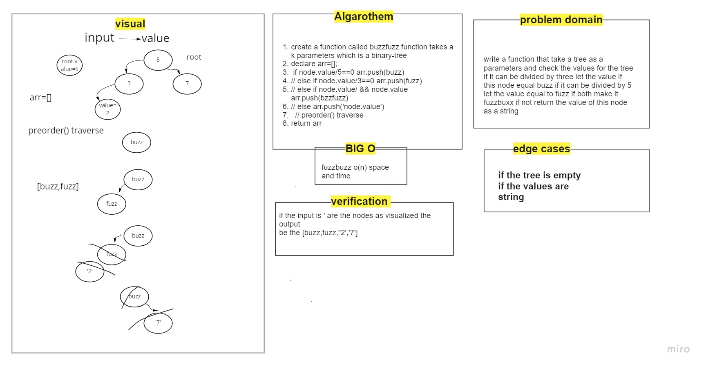
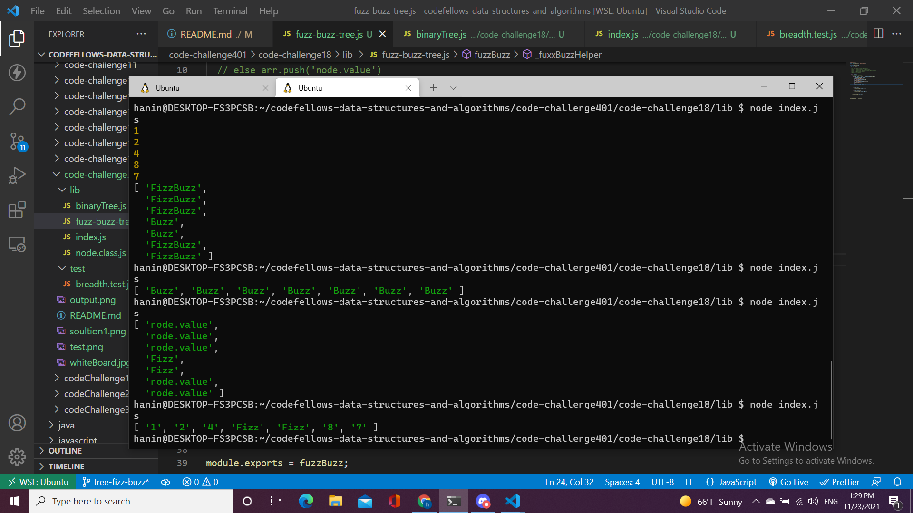
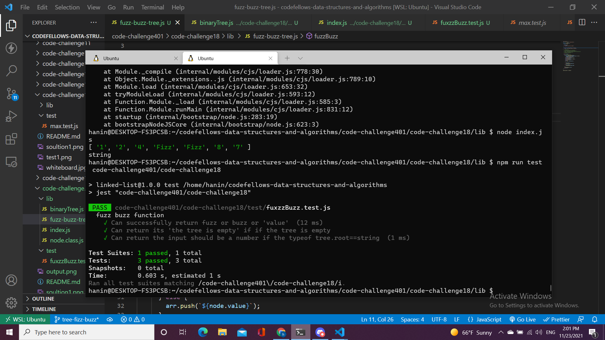

# Challenge Summary
implement another feature and method (max)to track the maxiumum number in the tree.
## Whiteboard Process

## Approach & Efficiency
* BIG O
   - add O(log n)
   - contains O(log n)
   - max O(n)
   - breadth O(n)
   - fuzzBuxx O(n)
   
## Solution

