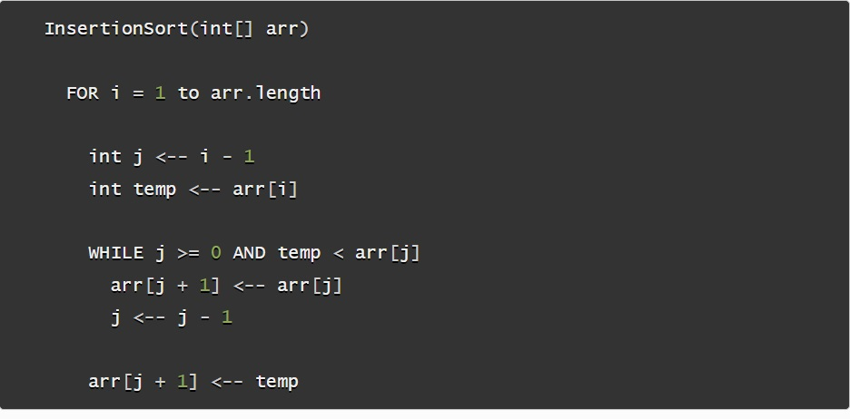
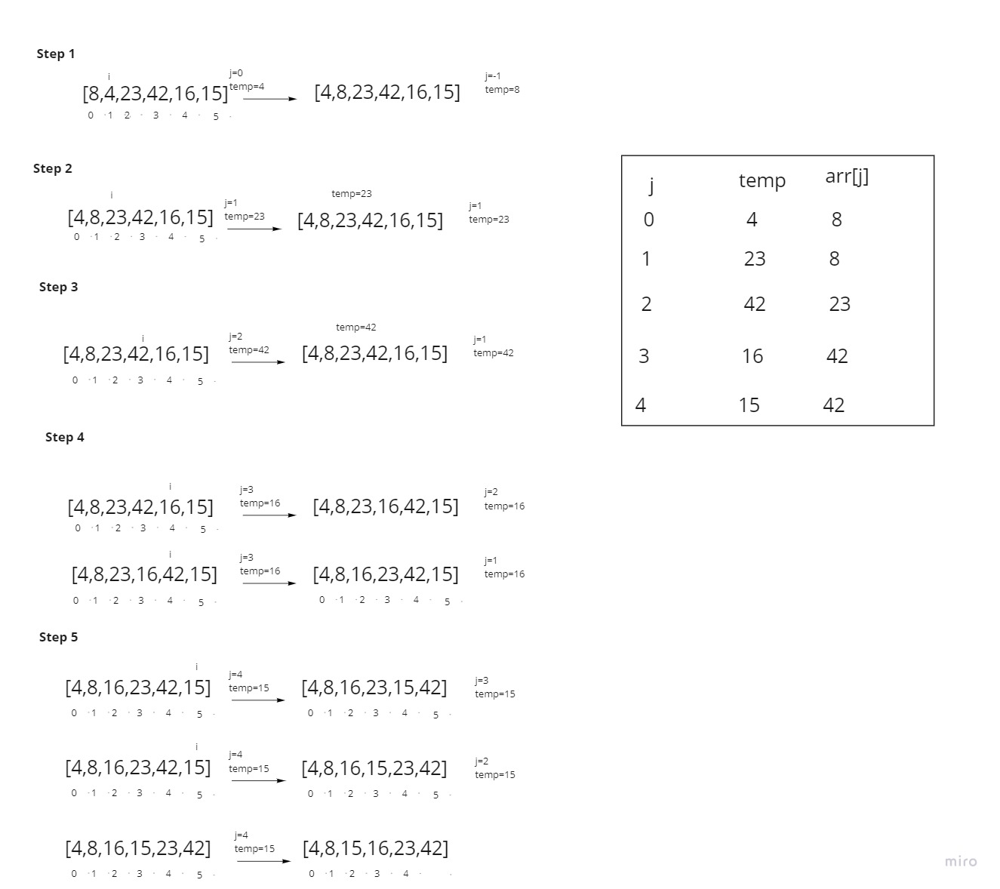

# Insertion Sort

## intro : 
 Insertion Sort is a sorting algorithm that traverses the array multiple times . The traversal keeps track of the minimum value and places it in the front of the array which should be incrementally sorted.

## Pseudocode :

## Trace : 
* Sample array  **[8,4,23,42,16,15]**

* Step 1: In the first step through of the sort, I started traverse from 1 and then evaluate if there is a smaller number in the array than what is currently present in index 0. I find this smaller number right away in index 1 which is 4. The temp value gets updated to the index of i . At the end of the evaluation, the smaller number will be swapped with the current value in index j. This results in our smallest number of our array being placed first.

* Step 2: The second pass through the array evaluates the remaining values in the array to see if there is a smaller value other than the current position of j. 8 is the 2nd smallest number in the array, so it “swaps” with itself. The temp value gets updated to the index of i.

* step 3 : The third pass through evaluates the remaining indexes in the array, starting at position 3. compare the temp and previous value(j) iand its not smaller . so keep updates to the temp value.

* Step 4: 
The forth pass we updates the temp value with the value of index[i] and then compare it to previous one . once its smaller swap between the positions . once the temp is smaller we will keep swap positions .

* Step 5 : 
The fifth pass updates the temp value with the value of index[i] and then compare it to previous once its smaller than the two previous positions it keeps traverse until its bigger then position 2.

## Efficency
* Time: O(n^2)
The basic operation of this algorithm is comparison. This will happen n * (n-1) number of times…concluding the algorithm to be n squared.
* Space: O(1)
No additional space is being created. This array is being sorted in place…keeping the space at constant O(1).
