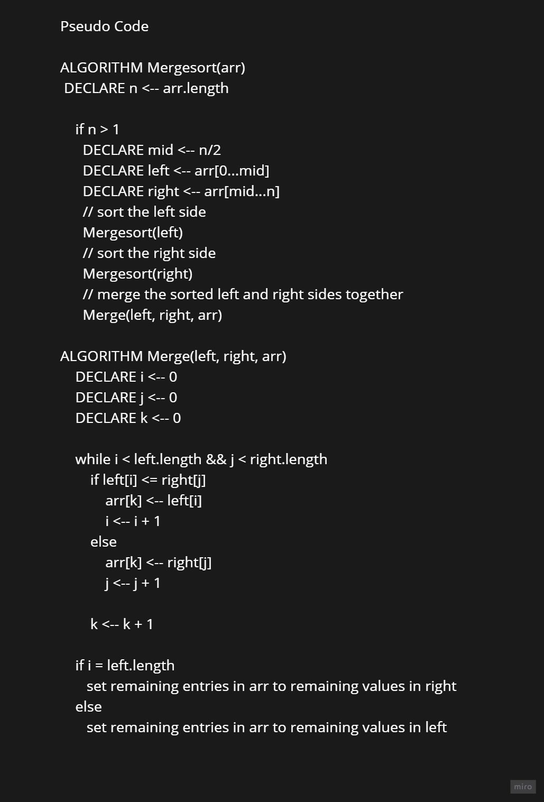
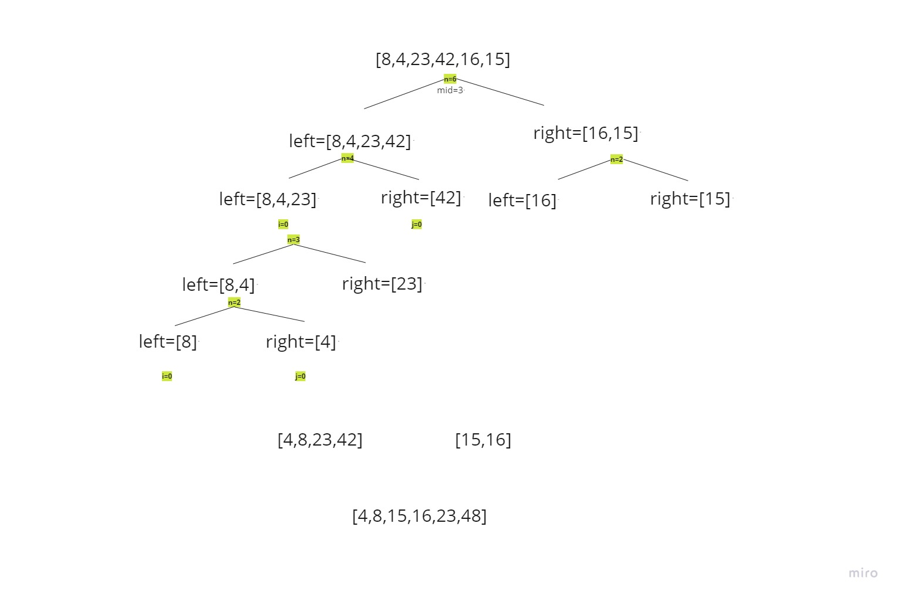

# Insertion Sort

## intro : 
 Merge sort is a sorting algorithm that uses the “divide into two ” concept.

Given an array, we first divide it in the middle and we get 2 arrays.

We recursively do this operation, until we get to arrays of 1 element

## Pseudocode :

## Trace : 
* Sample array  **[8,4,23,42,16,15]**

* Step 1: In the first step We first divide the array into 2 arrays:
as shown in the image below.

* Step 2: The second pass then we recursively divide those arrays until we get one element in each array:

* step 3 : The third pass we order(sort) each pairs of elements first:.

* Step 4: 
The last pass  we merge those 2 arrays by calling merge function:

## Efficency
* Time:  O(n log(n))
The basic operation of this algorithm is divied. This will happen n log(n) number of times…concluding the algorithm.
* Space: O(n)
this algorithm takes a lot of space and may slower down operations for the last data sets 