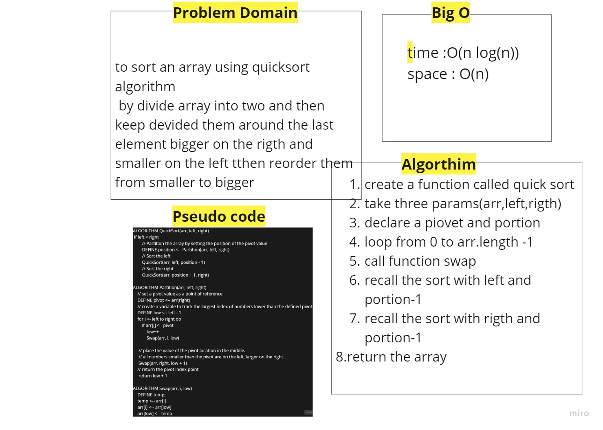
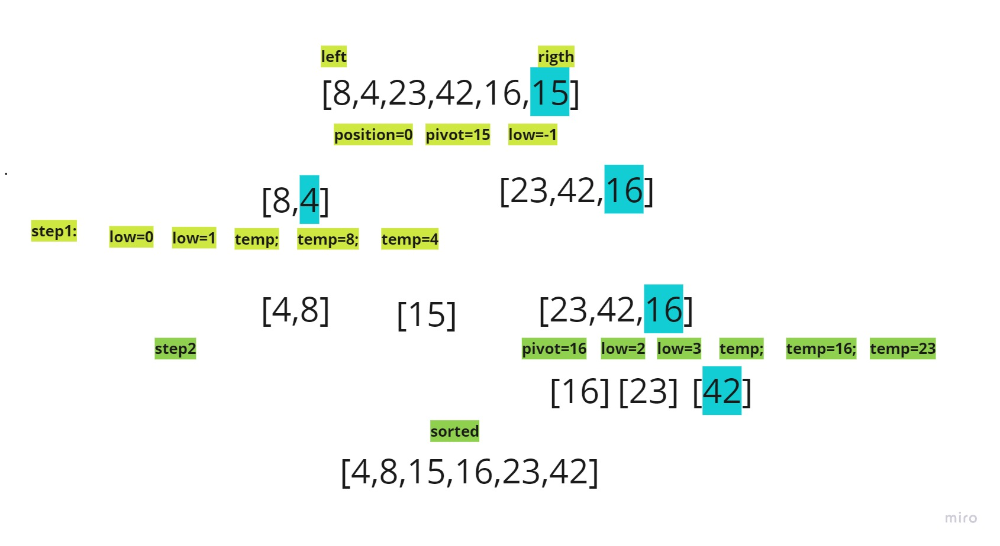
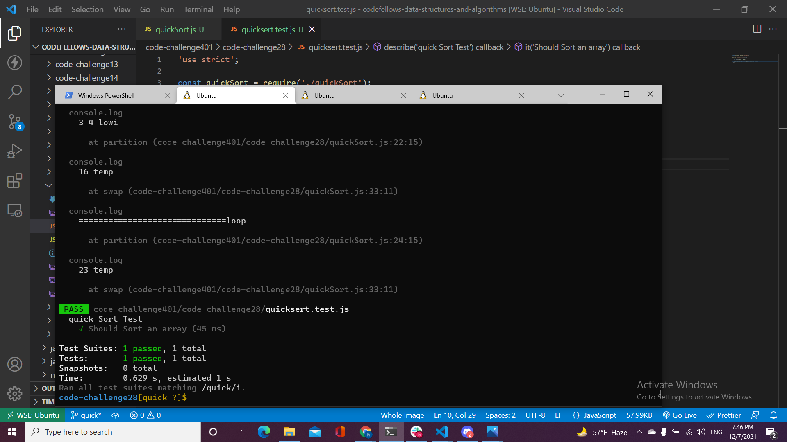

# Challenge Summary
To trace 
## Whiteboard Process

## Approach & Efficiency
## Efficency
* Time:  O(n log(n))
The basic operation of this algorithm is divied. This will happen n log(n) number of times…concluding the algorithm.
* Space: O(n)
this algorithm takes a lot of space and may slower down operations for the last data sets 
## Solution
