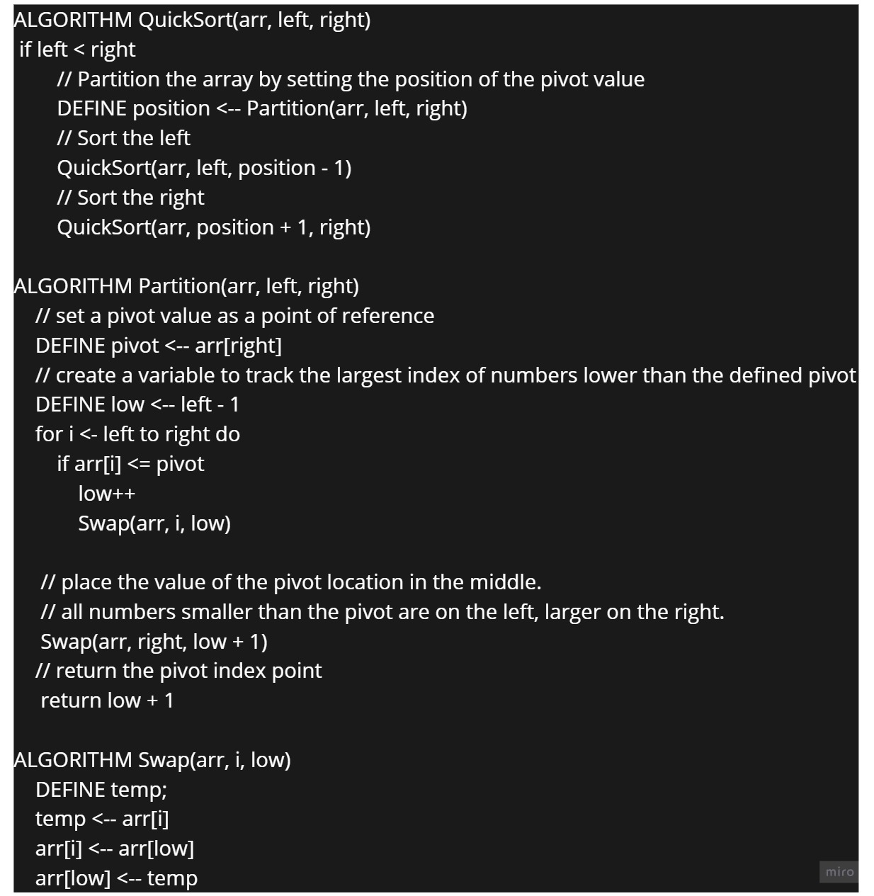

# Insertion Sort

## intro : 
QuickSort is a Divide algorithm. It picks an element as pivot and partitions the given array around the picked pivot.pick last element as pivot 

## Pseudocode :

## Trace : 
* Sample array  **[8,4,23,42,16,15]**

* Step 1 − 
    - Make last element as pivot. we select the rightmost index as pivot . declare a value “Low”  corresponding to the first index. 
    - Partition the array on the basis of pivot: Call for partitioning which rearranges the array in such a way that pivot (15) comes to its actual position (of the sorted array). And to the left of the pivot, the array has all the elements less than it, and to the right greater than it.Compare  with the pivot. 
    - Since 8 is less than 15 The array becomes[8,4,23,42,16,15]
    - We move on to the next element 4 which is again less than pivot (15) thus swapping it with 8 The array becomes[4,8,23,42,16,15]
    - Lastly, we swap our pivot with 50 so that it comes to the correct position.

* Step 2 − Apply quick sort on left partition recursively
 
* Step 3 − Apply quick sort on right partition recursively.

## Efficency
* Time:  O(n log(n))
The basic operation of this algorithm is divied. This will happen n log(n) number of times…concluding the algorithm.
* Space: O(n)
this algorithm takes a lot of space and may slower down operations for the last data sets 