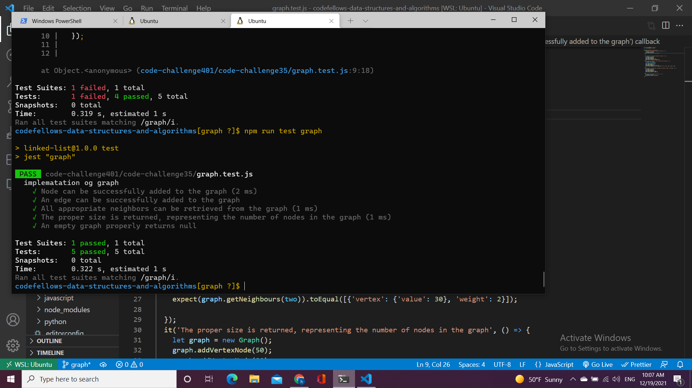

# Graph
*graph is a new data structure which is non linear*

## Challenge
to implement a graph.

## Approach & Efficiency
- Time O(n) 
- space This representation takes O(n + m) space because storing all the nodes takes O(n) space and the number of elements in the linked lists are O(m).

## API
- add node : this method is to add a new node to the graph.

- add edge : Adds a new edge between two nodes in the If specified, assign a weight to the edge
 Both nodes should already be in the Graph.

- get nodes : Returns all of the nodes in the graph as a collection (set, list, or similar).

- get neighbors : Returns a collection of edges connected to the given node
Include the weight of the connection in the returned collection.

- size :Returns the total number of nodes in the graph.

