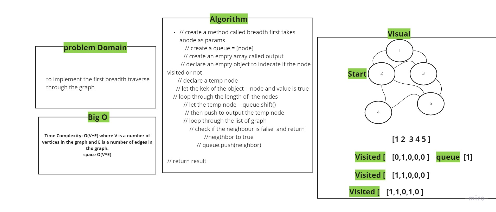

# Graph
*graph is a new data structure which is non linear*

## Challenge
to implement a graph.

## Approach & Efficiency
  - Time Complexity: O(V+E) where V is a number of vertices in the graph and E is a number of edges in the graph.
  - space O(V*E)

