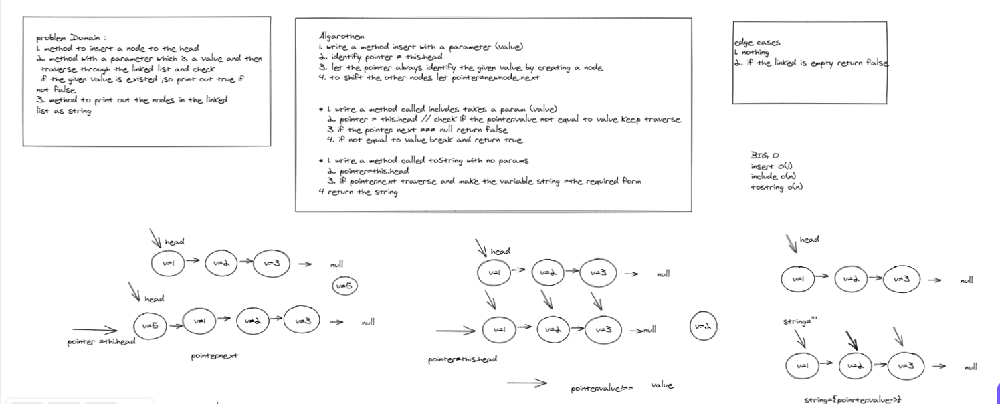
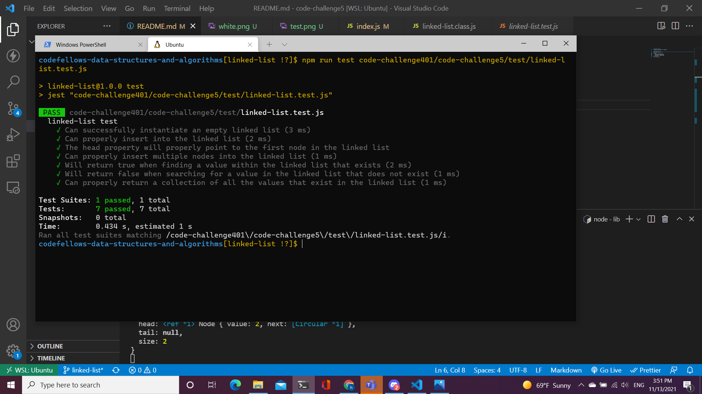

# Challenge Summary
 implement some methods to linkedList

## Whiteboard Process

## Approach & Efficiency
* BIG O
  - insert O(1) space//time
  - includes O(n) space//time
  - tostring O(n) space//time
## Solution

