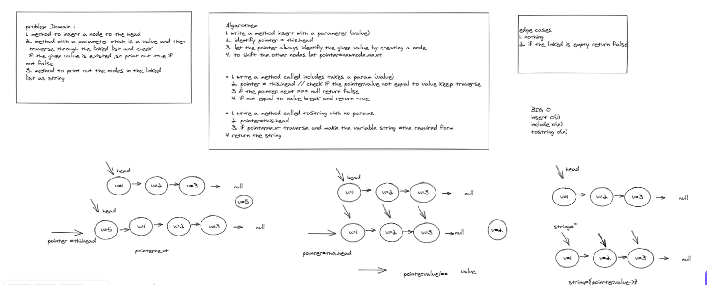
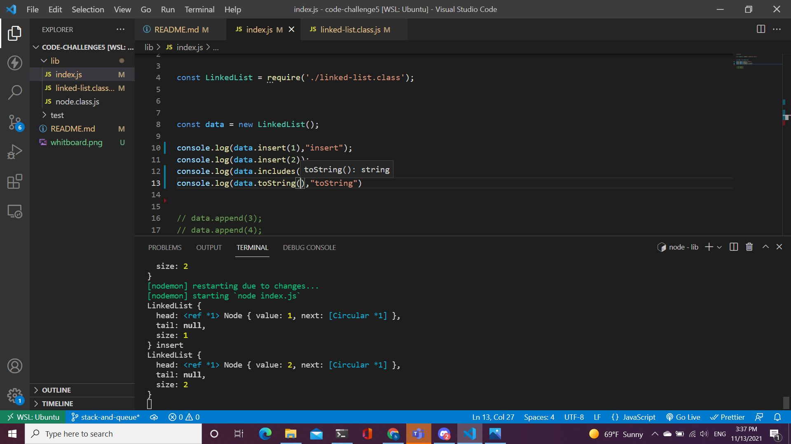

# Challenge Summary
 implement some method to linkedList (insert node to the head // and check if the linkedlist has the the value or not )

## Whiteboard Process

## Approach & Efficiency
* BIG(O)
    - insert=> O(1) space and time
    - includes => O(n) time //space o(1)
    - toString => O(n) time // space 

## Solution

